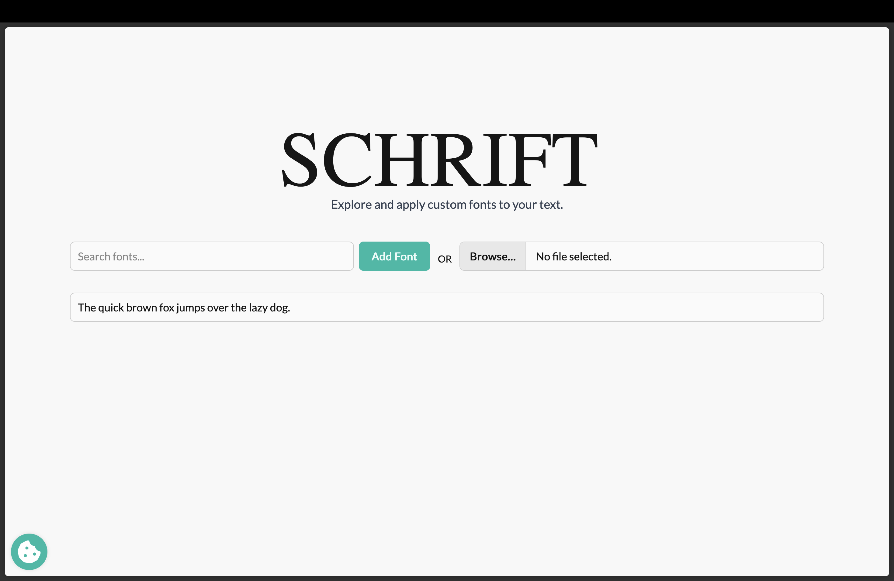

# SCHRIFT




**SCHRIFT** is a modern web application for exploring, testing, and applying fonts to your text. Built with Svelte, TypeScript, and Vite, it provides an intuitive interface for working with both Google Fonts and custom uploaded fonts.

## ✨ Features

- **🔍 Font Search**: Search through thousands of Google Fonts with autocomplete suggestions
- **📁 Custom Font Upload**: Upload your own font files (.woff, .woff2, .ttf, .otf)
- **✏️ Live Text Preview**: See how fonts look with your own custom text
- **🎨 Real-time Styling**: Apply fonts instantly and see changes in real-time
- **📱 Responsive Design**: Works seamlessly on desktop and mobile devices
- **🍪 Privacy Conscious**: Respects user consent for loading external Google Fonts
- **⚡ Fast Performance**: Built with Vite for lightning-fast development and build times

## 🚀 Getting Started

### Prerequisites

- Node.js 22.x or higher
- npm or bun package manager

### Installation

1. Clone the repository:
```bash
git clone <repository-url>
cd SCHRIFT
```

2. Install dependencies:
```bash
npm install
# or
bun install
```

3. Download the latest Google Fonts metadata:
```bash
npm run downloadFonts
```

4. Start the development server:
```bash
npm run dev
```

5. Open your browser and navigate to `http://localhost:5173`

## 🛠️ Development

### Available Scripts

- `npm run dev` - Start the development server
- `npm run build` - Build the application for production
- `npm run preview` - Preview the production build locally
- `npm run check` - Run TypeScript and Svelte checks
- `npm run downloadFonts` - Download the latest Google Fonts metadata

### Project Structure

```
SCHRIFT/
├── src/
│   ├── lib/
│   │   ├── components/     # Svelte components
│   │   ├── fonts.json      # Google Fonts metadata
│   │   └── state.svelte    # Application state management
│   ├── App.svelte          # Main application component
│   ├── main.ts             # Application entry point
│   └── app.css             # Global styles
├── public/                 # Static assets
├── downloadFonts.js        # Script to fetch Google Fonts metadata
└── package.json
```

## 🎯 How to Use

1. **Search for Fonts**: Use the search input to find Google Fonts. The autocomplete will suggest available fonts as you type.

2. **Upload Custom Fonts**: Click the file input to upload your own font files. Supported formats include WOFF, WOFF2, TTF, and OTF.

3. **Customize Text**: Change the example text in the input field to see how different fonts render your specific content.

4. **Preview Fonts**: Selected fonts will appear in the font list below, showing your text rendered in each font.

## 🔧 Tech Stack

- **Framework**: [Svelte 5](https://svelte.dev/) with TypeScript
- **Build Tool**: [Vite](https://vitejs.dev/)
- **Styling**: [Tailwind CSS](https://tailwindcss.com/) with [DaisyUI](https://daisyui.com/)
- **Font Loading**: [WebFontLoader](https://github.com/typekit/webfontloader)
- **Animations**: [Typewriter Effect](https://github.com/tameemsafi/typewriterjs)

## 🌐 Font Sources

- **Google Fonts**: Automatically fetches the latest font metadata from Google Fonts API
- **Custom Fonts**: Supports user-uploaded font files in common web formats

## 🔒 Privacy

SCHRIFT respects user privacy and implements cookie consent for loading external Google Fonts. Users can choose whether to allow external font loading while still being able to upload and use their own fonts.

## 📝 License

This project is private and not licensed for public distribution.

## 🤝 Contributing

This is a private project. If you have access to contribute, please follow standard Git workflow practices:

1. Create a feature branch
2. Make your changes
3. Test thoroughly
4. Submit a pull request

## 🐛 Issues

If you encounter any issues or have suggestions for improvements, please create an issue in the project repository.

---

**SCHRIFT** - Explore typography, one font at a time. 🎨
